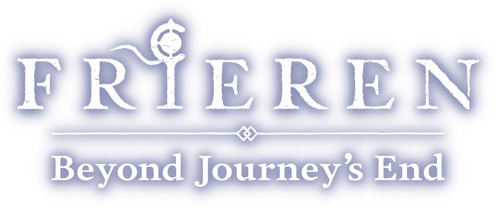
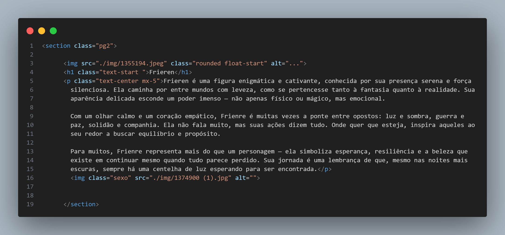
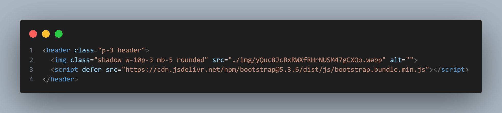
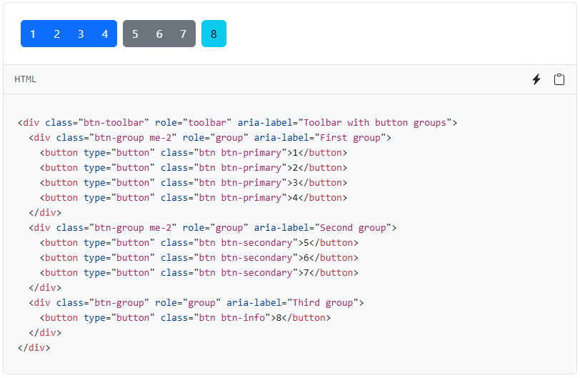
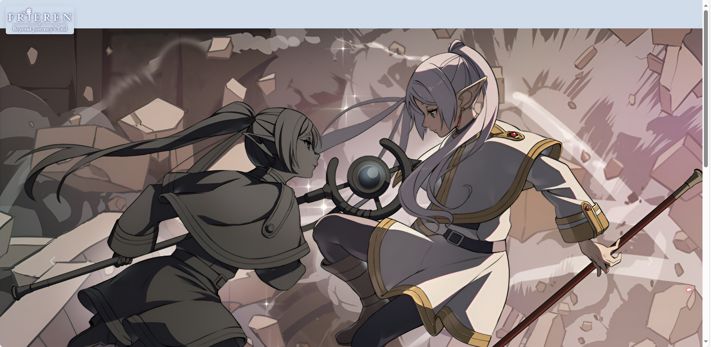
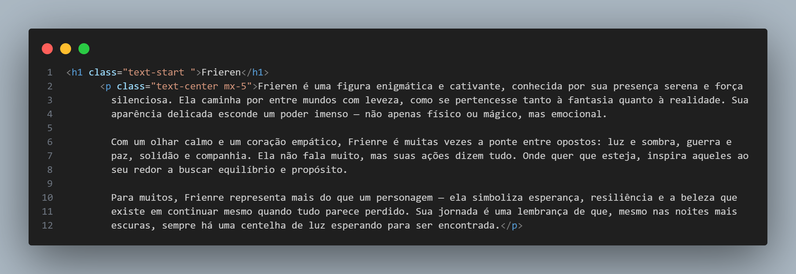

# Bootstrap-Frieren
> comentario foda
## um projeto do balacubaco
### outro projeto
#### aquie esta mais um dia
##### sobre o olhar sanguinario do vigia
###### salveeee

## topicos importantes do meu projeto

- topico 1
    - topico 2
- topico 3

1. topico com numero 1
2. topico com numero 2
3. topico com numero 3
4. topico com numero 4
5. topico com numero 5

1. topicom com bolinha 1
- topico 1
    - topico 2
- topic 3
2. topico com bolinha 2

- [x] teste
    - [ ] teste
- [ ] teste

```html
    <header class="p-3 header">
    
    <script defer src="https://cdn.jsdelivr.net/npm/bootstrap@5.3.6/dist/js/bootstrap.bundle.min.js"></script>
    </header>
```

Mussum Ipsum, cacilds vidis litro abertis. Per aumento de cachacis, eu reclamis. Si u mundo tá muito paradis? Toma um mé que o mundo vai girarzis! A ordem dos tratores não altera o pão duris. Suco de cevadiss deixa as pessoas mais interessantis.

A ordem dos tratores não altera o pão duris. Viva Forevis aptent taciti sociosqu ad litora torquent. Detraxit consequat et quo num tendi nada. Si u mundo tá muito paradis? Toma um mé que o mundo vai girarzis!

[Link de referencia markdown](https://dicionario.priberam.org/foda)



> [!IMPORTANT]
> teste abacaxi


# Site utilizando Bootstrap 
## Tema: livre

> O personagem utilizado foi a Frieren do anime Sousou no Frieren.

### Pagina 1: 
- **Header:** Quase finalizado, falta apenas colocar elementos para que o usuário possa se redirecionar de forma rapída e eficiente no centro do Header.


- Utilizar esse código para botões e depois estilizar:


- **Carrocel:** Esta totalmente finalizado, falta apenas colocar titulos nas imagens e descobrir uma forma de diminuir os tamanhos.




### Pagina 2: 

- **Imagens:** Organizar tamanho das imagens para que possa ficar igual ao esboço do site. 


- **Textos:** Estilizar textos por estarem em lugares errados ou desalinhados.



- Imagem exemplo para ambas anotações:

